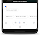

## Demo
To demonstrate the functionality and features of the **hida platform**, we have put together a demo with a few topics.

#### Install the Google Assistant App &nbsp;  &nbsp; 
The Google Assistant app is supported on both Android and iOS phones. Many of the modern Android phones come pre-installed with this App. If not, download it from [Play Store](https://play.google.com/store/apps/details?id=com.google.android.apps.googleassistant). iPhone users need to download it from [App Store](https://itunes.apple.com/us/app/google-assistant/id1220976145?mt=8).

#### Using the Assistant
The app is simple to use. Just speak (using the mic icon) to the Assistant what you wish to ask.

For more info check: [Google Assistant help](https://assistant.google.com/)

#### Invoking the Demo
Open the Google Assistant app and say, **Talk to Digital Trainer**, when the app is in *listening mode* (the mic icon at the bottom turns to a wave form while it is waiting for your request)
