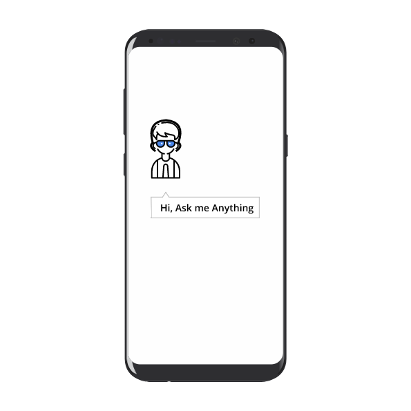

## Make ☝🏾 this happen
---

### Digital Assistant Solutions for

#### [HR and Staff Policy](./hr.html)
#### [Sales Product Trainings](./sales.html)
#### [Skill Enhancement Courses](./skill.html)
#### [Reference Manuals](./manuals.html)
&nbsp;
&nbsp;

### Demo using hida
Digital Trainer is a channel created to demonstrate the capabilities of hida. Say, **Talk to Digital Trainer** to your Google Assistant App to invoke the demo, or [Check these Instructions](./demo.html).

### How to use hida
Organisations can set up their **own channels** to serve their customers / teams with training content and other reference content. The **hida** platform makes it a *breeze* to do that. [Learn more about it](./hida-overview.html)

### To start your own channel
Write to: <a href="mailto:connect2RmR@gmail.com">connect2RmR@gmail.com</a>.
