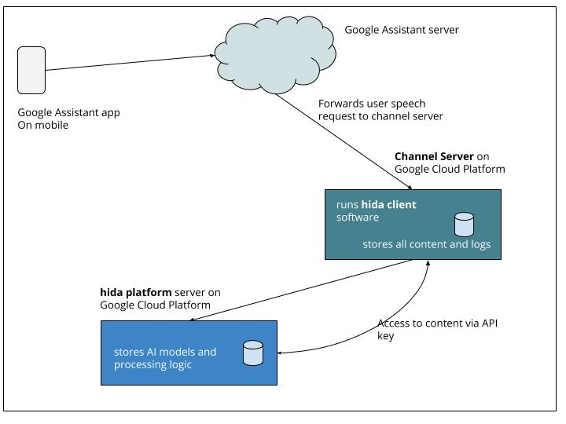

#### Overview of Technical Architecture

**Notes:**
- User from mobile on Google Assistant invokes `Customer channel`.
- Requests from user is first sent to the `Google Assistant` server and then forwarded to the `Channel Server`.
- Request from the `Channel Server` is forwarded to `hida server` which 
    * processes the request 
    * gets the relevant content from the `Channel Server`
    * renders the content in required format
    * send rendered content to the `Channel Server`
 - `Channel Server` returns rendered content to the User Mobile 

[>> back to hida overview](./hida-overview.html)
